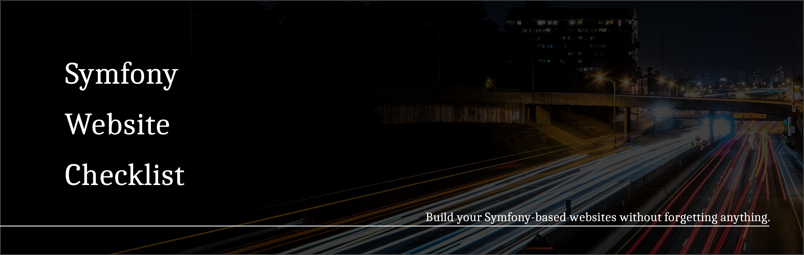

# Symfony Website Checklist 📑

## Summary

- [Elevator pitch](#elevator-pitch)
- [Philosophy](#philosophy)
- [1. Set up your environment](#1-set-up-your-environment)
- [2. Set up a new Symfony project](#2-set-up-a-new-symfony-project)
- [3. Set up your Twig templates](#3-set-up-your-twig-templates)
- [4. Produce your models](#4-produce-your-models)
- [5. Set up translations (even if you only use one language)](#5-set-up-translations-even-if-you-only-use-one-language)
- [6. Set up your basic application logic](#6-set-up-your-basic-application-logic)
- [7. Secure your app](#7-secure-your-app)
- [8. Use TailwindCSS for styles and RWI](#8-use-tailwindcss-for-styles-and-rwi)
- [9. Pre-flight checks](#9-pre-flight-checks)
- [10. Dockerize your project](#10-dockerize-your-project)

***

### Elevator pitch

> __This project lists all the mandatory steps I recommend to build a website using:__
>
> - __HTTPS + HTML output,__
> - __A local, PHP-integrated server first, Docker as a "maybe" later on,__
> - __Symfony,__
> - __Twig,__
> - __Doctrine ORM,__
> - __Any RDBMS.__

#### This project assumes you start **from zero**.

#### This project README will remain in *one* file to ease searching from a browser.

#### All the files referenced in this document can be found in the `/files-you-will-need` directory of this repository. This directory reflects the exact, expected directory tree as you grow it.

***

### Philosophy

<table>
    <thead>
        <tr>
            <th>The idea behind this is as follows:</th>
        </tr>
    </thead>
    <tbody>
        <tr>
            <td>The exhaustive version of a HowTo would be the official <a href="https://symfony.com/doc/current/index.html" title="View official documentation">documentation</a>.</td>
        </tr>
        <tr>
            <td>The slightly slower version of this would be to watch tutorials and use cases from <a href="https://symfonycasts.com/" title="Go to the SymfonyCasts website">SymfonyCasts</a>.</td>
        </tr>
        <tr>
            <td>The faster way would be to read <a href="https://symfony.com/doc/current/the-fast-track/en/index.html" title="Read The Fast Track">The Fast Track</a>, precisely written by <a href="https://twitter.com/fabpot" title="Follow Fabien on Twitter!">Fabien Potencier</a>.</td>
        </tr>
        <tr>
            <td>The fastest way to me, trading possibilities for opinions, should be this repository.</td>
        </tr>
    </tbody>
</table>

All contributions and suggestions are welcome. 😇

***

***

## 1. Set up your environment

1. Set up PHP/latest.  
   On Linux, use your package manager (like Aptitude or Yum). `sudo su && apt-get update && apt-get install php8` at least.  
   On MacOS, use [Brew](https://brew.sh/) through `brew install php`.  
   On Windows:
    - Download it from [windows.php.net](https://windows.php.net/download/) (take the **latest version, VS16 x64 Thread Safe, with OpenSSL**)
    - Unzip it to `C:\php[VERSION DIGITS]`.
    - Then change your `PATH` system variable (`Windows + R`, type `PATH`, hit `Enter`, click on `Environment Variables`
      , then your user variables, edit the `PATH` entry and append the previously unzipped directory path to it).
2. Copy `php.ini-development` to `php.ini` in your
3. Configure your PHP locally for your `dev` environment.
    - Set `memory_limit` to `8M`
    - Set `max_ececution_time` to `200`
    - Set `upload_max_filesize` to `200M`
    - Uncomment the `extension_dir` directive. Careful: it's different on Windows vs the rest of the world.
    - Uncomment to enable the following extensions: `bz2, curl, gd, intl, mbstring, mysqli, openssl, pdo_mysql, sodium`.
    - Define the `date.timezone` directive to your local timezone.
        - Mine is `"Europe/Paris"`, for instance.
        - The complete list is [here](https://www.php.net/manual/en/timezones.php).
4. On Windows, download and install [Composer Setup](https://getcomposer.org/Composer-Setup.exe)
   and [Symfony Setup](https://get.symfony.com/cli/setup.exe).
5. Check that you got everything OK using `symfony check:requirements` in any directory. Ignore the *"Enable or install a PHP accelerator"* advice.
6. Start from an empty directory, use `symfony new [your_project_directory_name]`.
7. Create a `README.md` file inside the root directory and put everything you can document inside, at least those sections:
    - The **title** of the project.
    - The **purpose** of the project.
    - How to **set it up**.
    - How to **run** basic commands it requires to work (including Docker).
    - **Contribution** / modification instructions.
    - Architectures / coding / technology **choices**.
8. Add a `readme-sources` directory at the root of your project. Anything that is included in MarkDown documentation goes there.
9. Install a RDMBS (let's start with that, right?), like MySQL, MariaDB, or PostGreSQL. Same again:
    - On Windows, just download the installers and set them up as services, don't use standalone Zip files.
    - On MacOSX, use [Brew](https://brew.sh/) through `brew install mysql` then `brew services start mysql`.
10. Set up your DotEnv files:
    - Create a `.env.local` file by copying the `.env` one.
    - Change the `APP_SECRET` value to anything.
    - Change the `DATABASE_URL` to the appropriate values to connect to your RDBMS.
11. If you use PHPStorm, use *`File > Manage IDE settings > Import settings`* and pick up the `phpstorm-settings.zip` included in this repository.

## 2. Set up a new Symfony project

1. Install PHP-Stan as a dev dependency (`composer require --dev phpstan/phpstan`).
    - You can do this in a separate directory outside your project as a better practice.
    - Create your configuration file for PHP-Stan if you know what you're doing. If you don't, just use the one in this repository (`phpstan.neon`).
    - Let it at the root of your project for now.
    - Also install additional Symfony and Doctrine plugins:
        - `composer require --dev phpstan/extension-installer`,
        - `composer require --dev phpstan/phpstan-symfony`,
        - `composer require --dev phpstan/phpstan-doctrine`.
    - Make sure PHP-Stan also checks the `config` directory, and goes to the maximum level. Mine looks like this:

```yaml
parameters:
    level: 9
    paths:
        - config
        - src
        - tests
    checkGenericClassInNonGenericObjectType: false
    ignoreErrors:
        - '#Property .* is never written, only read\.#'
    symfony:
        container_xml_path: var/cache/dev/App_KernelDevDebugContainer.xml
```

2. Install PHP-CS-Fixer as a dev dependency (`composer require --dev friendsofphp/php-cs-fixer`).
    - You can do this in a separate directory outside your project as a better practice.
    - Create your configuration file for PHP-CS-Fixer if you know what you're doing. If you don't, just use the one in this repository (`.php-cs-fixer.dist.php`).
    - Let it at the root of your project for now.
3. Install Psalm as a dev dependency (`composer require --dev vimeo/psalm`).
    - You can do this in a separate directory outside your project as a better practice.
    - Create your configuration file for Psalm if you know what you're doing (`php vendor/bin/psalm --init`). If you don't, just use the one in this repository (`psalm.xml`).
    - Let it at the root of your project for now.
    - Also install additional Symfony and Doctrine plugins: `composer require --dev psalm/plugin-symfony`
      and `composer require --dev weirdan/doctrine-psalm-plugin`.
4. Create a shell command to start them, at the root of your directory (you can safely copy the ones in this repository).
    - Give them short names so you don't lose time calling them manually.
    - Don't start their names with "`php`", they all share this and slows down your CLI calls.
    - Call them `csfixer`, `stan` and `psalm`, with appropriate shell extensions (`.bat` or `.sh`).
5. Add a `.editorconfig` file at the root directory of your project to ensure your IDE settings don't get messed up.
    - At least set it up so you use UTF-8, `LF` characters for newlines and 4 spaces as tabulations.
    - If you don't, just use the one in this repository (`.editorconfig`).
6. If you know what you're doing, use REDIS to store PHP sessions at least. Try it for custom cache pools (this goes beyond the purpose of this document).

## 3. Set up your Twig templates

1. Identify your application domains. If you have no idea what this means, or which to use, simply go with `Admin`
   and `Front`, plus one for each of your application "modules".
2. Install Twig and the extensions you're going to use.
    - `composer require twig`
    - `composer require twig/extra-bundle`
3. Create global variables for Twig that you're going to need, simply edit `config/packages/twig.yaml` as follows:

```yaml
twig:
    # ...
    globals:
        # Used for the tab title 
        globals_website_title_suffix: ' | Your website suffix'
        # Used for OpenGraph
        globals_website_url: 'https://your.super.url'
        # Used at many places
        globals_website_name: 'Your website name'
        # Used for schema.org data
        globals_website_subtitle: 'Something like your slogan'
        # Used for OpenGraph data
        globals_website_description: 'The long description, mostly for <meta> tags and OpenGraph description.'
        # You'll need to change this if you want to enable Facebook Sharer
        globals_facebook_app_id: '1111111111111111'
    # ...
```

4. For the following steps, if you want to be lazy, just copy the templates from this repository for a start:
    - `admin_layout.html.twig` goes to `templates/admin`
    - `front_layout.html.twig` goes to `templates/front`
    - `base.html.twig` goes to `templates`
5. If you didn't copy the files from the previous step, then do as follows:
    - Create a layout file inside each domain subdirectory, name it as follows: `[domain]_layout.html.twig`.
    - Add a base class block to your `<html>` tag in `base.html.twig` template and override it in each `[domain]_layout.html.twig` templates.
    - Define your metadata in your `base.html.twig`, at least:
        - The viewport strategy for CSS processing.
        - OpenGraph metadata.
        - HTML metadata.
        - Schema.org metadata.
        - Twitter / Facebook metadata.
        - Webpack Encore styles and scripts tags.
        - Dynamic <title> markup.
        - UTF-8 charset.
        - A canonical markup for SEO (`<link rel="canonical" href="{{ url(app.request.attributes.get('_route'), app.request.attributes.get('_route_params')) }}">`).
        - Overridable blocks for all of these.
6. Your `/templates` directory should at least contain:
   - `admin`
   - `common`
   - `front`
   - `registration`
   - `security`
   - `base.html.twig`
7. Make sure **all** the files and directories under `/templates` use snake_case only for their filenames.

## 4. Produce your models

1. List all your entities, think about them until you can't find new fields/properties to add.
2. Add Doctrine DBAL + ORM (`composer require orm`).
3. If you want to use migrations, add Doctrine Migrations (`composer require migrations`).
    - If you have no idea what to do and work alone on your project, don't use them (`composer remove doctrine/migrations`, same for dependencies).
    - If you end up using them, create a `/migrations` directory at the root directory of your project.
4. Install the MakerBundle (`composer require --dev maker`).
5. Use the MakerBundle to generate their CRUDL. For each entity, run `php bin/console make:crud`.
6. Create a `Model` directory under `/src` to store all models that are not entities.
7. Make sure **all** the files and directories under `/src` use CamelCase only for their filenames.
8. Check that your entities are valid using `php bin/console doctrine:schema:validate`.
9. If you're using migrations, check that you're good with `php bin/console doctrine:migrations:up-to-date`;

## 5. Set up translations (even if you only use one language)

1. Install the Translation component: `composer require symfony/translation`.
2. Set up your default language in `config/packages/translation.yaml`. Mine looks like this (for non-geographic English as the default language):

```yaml
framework:
    # ...
    default_locale: en
    translator:
        default_path: '%kernel.project_dir%/translations'
        fallbacks:
            - en
    # ...
```

3. Set up your languages logic in `config/services.yaml`. Mine looks like this:

```yaml
parameters:
    # ...
    app.supported_locales:
        - en
        - fr
    # ...
```

4. Create a `messages.[yourdefaultlanguage].yaml` in the `translations` folder. Don't use ICU unless you know why.
5. Create a `validators.[yourdefaultlanguage].yaml` in the `translations` folder. Don't use ICU unless you know why.
6. Repeat last two steps for each additional language you'll need.
7. Whatever you'll do, make sure you keep alphabetical / ASCII order for translation keys inside YAML files.
8. Whatever you'll do, make sure you'll ONLY use YAML-parse syntax for keys (e.g. `front.forms.users.create.name.help`).
9. Make sure **all** the files and directories under `/translations` use snake_case only for their filenames.

## 6. Set up your basic application logic

1. Create a subdirectory for each of your domains, at least for `Admin` and `Front` (that's already enough):
    - In `src/Controller`.
    - In `src/Form`.
    - In `src/Model`.
2. Do the same in the Twig `/templates` directory: create `/admin` and `/front` subdirectories in it.
3. Move your CRUDL controllers to `src/Controller/Admin`, and their templates to `templates/admin`.
4. Update the namespaces, templates name references in the controllers and templates according to last point.
5. Inside each `messages.[language].yaml` translations file, start root keys with your domains, all snake case. At least they should look like this:

```yaml
front:

admin:
```

7. Add constraint validation to the **maximum** properties you can set to in your entity files.
    - Run `composer require symfony/validator doctrine/annotations`.
    - This supposes, at least:
        - That ALL your fields have a `@Assert`
8. Make sure all your entities are historizable, which means they should have creation and last modification dates attached:
    - To achieve that, use a PHP trait in all your entities.
    - If you have no idea what this means, simply use the file `HistoryTrackableEntity.php` in this repository.
    - Put the trait in your `src/Entities` directory.
    - Add an `@ORM\HasLifecycleCallbacks` annotation to all your entities.
    - Add `use HistoryTrackableEntity;` after each Entity class opening bracket (first line, before constants and properties).
    - Update the database (`php bin/console doctrine:schema:update` or use migrations if you chose to use them).
9. Review ALL your forms, they need to have:
   - `empty_data` provided, especially for non-nullable fields.
   - `help` for all fields with filling guidelines.
   - A clear `label` for all fields.
   - A placeholder for all fields (`'attr' => ['placeholder' => 'your.placeholder.translation.key']`).
10. Define a custom, static menu configuration. If you want a dynamic one or use a premade bundle like KnpMenuBundle, it's up to you.
    - Create `model/Admin/AdminMenus.php` and `model/Front/FrontMenus.php` files.
    - Just make them use a multidimensional `public static array $adminMenuTree = [];` array structure that returns all menus. See included `FrontMenus.php` class. 
    - Create a Twig extension to output them, either use `make:twig-extension` or just copy the one included in this repository (`MenuExtension.php`).
    - Then make a common template for menus (`templates/common/_menu.html.twig`) or just copy the one included in this repository.
11. Remove the dead code in your entity repositories (`src/Repository`).
12. Unify templates as much as you can:
    - Move any MakerBundle-generated `_delete_form.html.twig` and `_form.html.twig` to `templates/admin/common`.
    - Update all the CRUDL templates so they use those.
    - Delete the remaining, unused templates.

## 7. Secure your app

1. Make a User class using the MakerBundle: `php bin/console make:user`.
2. Make a authentication plugin using the MakerBundle: `php bin/console make:auth`. Pick a custom authenticator name.
3. Don't forget to make the appropriate CRUDL using the MakerBundle: `php bin/console make:crud`.
4. Modify the `new` and `edit` actions of the generated controller so that they encode passwords using `UserPasswordHasherInterface`.
5. Define your roles in `config/packages/security.yaml`. Mine looks like this (read the comments):

```yaml
security:
    enable_authenticator_manager: true
    password_hashers:
        Symfony\Component\Security\Core\User\PasswordAuthenticatedUserInterface: 'auto'
        App\Entity\User:
            algorithm: auto

    providers:
        app_user_provider:
            entity:
                class: App\Entity\User
                property: email # Can be anything you want
    firewalls:
        dev:
            pattern: ^/(_(profiler|wdt)|css|images|js)/
            security: false
        main:
            lazy: true
            provider: app_user_provider
            custom_authenticator: App\Security\AppAuthenticator # Use your custom authenticator name here
            logout:
                path: app_logout
                target: app_home # Set this to your public homepage, that defaults to "/" at least 

    access_control:
    # Uncomment this after step 6. in this chapter
    # - { path: ^/admin, roles: ROLE_ADMIN }

    role_hierarchy:
        # Administers the whole website
        ROLE_ADMIN: ROLE_USER
        # Simple role added by Symfony
        ROLE_USER:
```

6. Then create your admin user while the CRUDL are public, and set yourself to the maximum administrator role level.
7. Once your admin user is created:
    - Uncomment the `access_control` directive in the file above
    - Prefix your generated `UserController` with: `#[Route('admin/user')]`.
    - Do the same for ALL the controllers you set:
        - behind the `src/Controller/Admin` directory,
        - the admin ones wherever they are,
        - and all the generated CRUDL ones.
8. Use the MakerBundle to make a registration process (`php bin/console make:registration-form`).
9. The `SecurityController.php` and `RegistrationController.php` stay at the root of `src/Controller` directory.
10. Run `composer require tgalopin/html-sanitizer-bundle` and sanitize all user-generated fields that are displayed without escaping.

## 8. Use TailwindCSS for styles and RWI

1. Update `config/twig.yaml` and set this:

```yaml
twig:
    # ...
    form_themes: [ 'tailwind_2_layout.html.twig' ]
    # ...
```

2. Add Webpack Encore, with PurgeCSS and PostCSS:
    - Install Node (pick the latest LTS version):
        - On Windows and MacOS, just use the [installer](https://nodejs.org/en/download/) and restart your shell.
        - On Linux, use your package manager (like Aptitude or Yum). `sudo su && apt-get update && apt-get install nodejs npm` at least.
    - Run `composer require encore` and `npm install`.
    - Run `npm install -D tailwindcss postcss-loader purgecss-webpack-plugin glob-all path autoprefixer`.
    - Setup Webpack, PostCSS and Tailwind.
        - If you don't know what this means, simply copy/overwrite the following files from this repository to your project root directory:
            - `postcss.config.js`
            - `tailwind.config.js`
            - `webpack.config.js`
    - Run `npm run build`.
3. Make sure you have the following structure at least in `assets`:
   - `controllers`
   - `favicon`
   - `fonts`
   - `images`
   - `styles`
   - `app.js`
   - `bootstrap.js`
   - `controllers.json`
4. Create a favicon and add its configuration to your `base.html.twig` and `assets/favicon/browserconfig.xml`.
5. Create a default OpenGraph image for your site and put it in `assets/images` (name it `ogimage.jpg` if you copied the included files of this project).
6. Prepare an external shell script to start your project from your user home directory. See an example with `start-project` included scripts.

## 9. Pre-flight checks

1. Run `symfony check:security` to validate that your project has no known vulnerabilities from its dependencies.
2. Create a deployment script for your non-dev environments.
    - If you don't know what you're doing, use the one provided in this repository (`production-deployment.sh.dist`) for a start.
    - On your non-dev environments, copy the `production-deployment.sh.dist` to `[environment]-deployment.sh`.
    - Check that they're in the `.gitignore` and only on destination servers filesystems. Don't version the final ones.
    - Use those scripts to clear OpCache and realpath caches.
3. Make sure your application only uses HTTPS. Your `config/services.yaml` should contain this:

```yaml
parameters:
    # ...
    router.request_context.scheme: 'https'
    asset.request_context.secure: true
    router:
        request_context:
        scheme: 'https'
    asset:
        request_context:
            secure: true
    # ...
```

4. Validate your project with PHP-Stan (using the shell scripts created in #1.).
5. Validate your project with Psalm (using the shell scripts created in #1.).
6. Validate your project with PHP-CS-Fixer (using the shell scripts created in #1.).
7. If needed, configure your CI. There's an included sample file for GitLab CI inside this project, see `.gitlab-ci.yml` (checks that you didn't forget PHP-CS-Fixer).
8. Add a `robots.txt` file inside the `public` directory. Use the one provided in this repository for a start.
9. Add a `site.webmanifest` file inside the `public` directory. Use the one provided in this repository for a start.
10. Enable it by adding this to your `base.html.twig` file: `<link rel="manifest" href="{{ asset('site.webmanifest') }}">`.
11. Finally, you can start your project (locally) using:
    - `symfony local:server:ca:install`
    - `symfony server:start -d`
    - `npm run watch`
12. And you can prepare your assets for deployment using: `npm run build`.
13. Configure your non-dev environments (this goes way beyond this project boundaries ^^). If your non-dev servers are Apache, you can use `composer require symfony/apache-pack`.
14. Start writing PHPUnit tests under the `tests/` directory. You will need WAY less of them as long as your code passes PHP-Stan and Psalm maximum level scans.
15. On production servers, make sure:
    - PHP `memory_limit` is set just around `8M` for CLI and `1M` for web SAPIs. More if PHP processes files.
    - PHP `max_execution_time` is set to `1200` for CLI and `30` for wep SAPIs. More for CLI if your app has heavy CLI processing.
    - PHP `realpath_cache_size` is set to `512K` for CLI and `16M` for wep SAPIs.
    - PHP `realpath_cache_ttl` is set to `600` for CLI and `2000` for wep SAPIs.
    - PHP OpCache is configured:
      - `opcache.preload=[your project path]/config/preload.php` and set `parameters.container.dumper.inline_factories: true` in `config/services.yaml`
      - `opcache.preload_user=www-data`
      - `opcache.memory_consumption=1M`
      - `opcache.max_accelerated_files=100000`
      - `opcache.validate_timestamps=0` (WARNING: this implies that your deployment scripts empty OpCache pools)
    - You dump the autoloader classmap statically in your deployment script (`composer dump-autoload --no-dev --classmap-authoritative`).
    - You have chmod'ed (`755`) your upload, cache and logs directories. Use umask if necessary.
    - You deploy via Git exclusively:
      - `git fetch --all`
      - `git rev-parse refs/remotes/origin/master` (or any deployment branch)
      - `git checkout -f master` (or any deployment branch)
    - You have entities updated through deployment. Migrations if you're not alone, straight schema update if you are (see above).
16. Start profiling your app:
    - Use a free [BlackFire](https://www.blackfire.io/) environment (limited, if you're not an individual, consider buying a license) and profile your app.
    - Use the Symfony profiler (`composer require --dev symfony/profiler-pack`) and take a look at:
      - Your queries. You can reduce them to the minimum (between 0 and 1 per page) easily.
      - Use Twig `` for anything locally cacheable especially the results of Twig functions that use DB. 
      - Otherwise, add caching to your controllers and models:
        - Create a cache pool.
        - Use it by memoizing your actions.
17. Add expiration headers to anything that simply returns entities for a given HTTP request, give them at least 10 minutes, at best a day or more. 
18. Add validation headers to any complex action that has non-linear behaviour.
19. Make sure you have resized all user-generated images with LiipImagineBundle (`composer require liip/imagine-bundle`) and use `srcset` HTML5 attribute.
20. Make sure you have optimized **all** your theme images using [TinyPng](https://tinypng.com/). 
21. Make sure you have no remaining missing translations (`php bin/console debug:translation [your locale]`).
22. Make sure you browser console is absolutely empty, no:
    - CORS alerts
    - JavaScript errors
    - Bad cookie API usages
    - 404 on files
    - Other browser warnings

## 10. Dockerize your project

1. Create a `docker-sources` directory inside the project root directory. You'll put your Docker Compose files inside.
2. Create a `docker-sources/containers-config` directory inside. You'll put your Dockerfiles inside, named according to the container name.
3. Create a `environment-files` directory inside the project root directory, and move all your DotEnv files inside.
4. Make Symfony aware that they moved, modify your `composer.json` file as follows:

```json
{
    "...": "...",
    "extra": {
        "...": "...",
        "runtime": {
            "dotenv_path": "environment-files/.env"
        }
    }
}
```

5. Create at least a `global-docker-compose.yml` inside `docker-sources`.
6. Create at least a `[environment-name]-docker-compose.yml` inside `docker-sources` (like `dev-docker-compose.yml`).
7. Notify your Docker Compose files that the environment files they should use are inside this directory.
8. Add a shell script inside the project root to start the project Docker containers fast
   (a sample one is included in this repository: `build-and-run-dev-docker-containers.bat`).

The rest will be part of your project choices. ;)

***

*Image taken from free image stock [UnSplash / Guillaume Jaillet](https://unsplash.com/photos/Nl-GCtizDHg).*
